# Advprog Module 11 Tutorial - Deployment on Kubernetes
Hadyan Fachri\
2306245030\
Advprog A

## Reflection on Hello Minikube
**1. Compare the application logs before and after you exposed it as a Service. Try to open the app several times while the proxy into the Service is running. What do you see in the logs? Does the number of logs increase each time you open the app?**

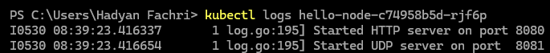

Gambar berikut adalah situasi dimana setelah saya menjalankan `kubectl logs` yang mana digunakan untuk melihat log suatu aplikasi sebagai suatu service namun belum terexpose karena belum menjalankan `kubectl expose deployment` ke aplikasi yang ingin di expose.

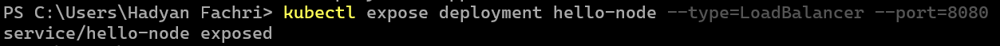

Disini saya menjalankan `kubectl expose deployment` untuk mengekspose aplikasi yang ingin di expose.

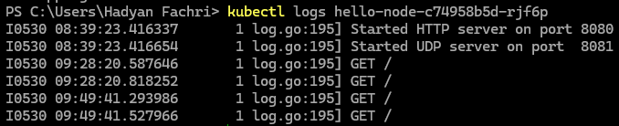

Gambar berikut aadalah situasi dimana setelah saya menjalankan `minikube service` secara dua kali, terlihat disini bahwa ada 4 baris logs baru yang sebelumnya tidak ada, yaitu logs GET/ yang menandakan aplikasi berhasil dikunjungi dengan menampilkan GET request.

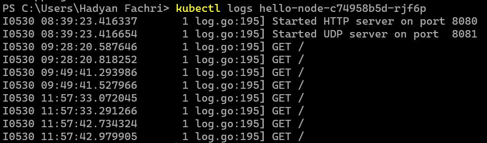

Disini saya mencoba menjalankan lagi `minikube service` dan mengunjungi aplikasi sebanyak 2 kali. Yang terjadi adalah logs bertambah sebanyak 4 baris baru. Jadi setiap mengunjungi aplikasi yang sudah diexpose akan menampilkan 2 baris logs GET/ setiap 1 kali kunjungan.

**2. Notice that there are two versions of `kubectl get` invocation during this tutorial section. 13The first does not have any option, while the latter has `-n` option with value set to `kube-system`. What is the purpose of the `-n` option and why did the output not list the pods/services that you explicitly created?**

Opsi `-n` pada perintah `kubectl get` digunakan untuk menentukan namespace spesifik tempat objek Kubernetes (seperti Pod atau Service) akan dicari. Namespace dalam Kubernetes bisa diibaratkan seperti direktori atau folder terpisah yang menyimpan sumber daya tertentu. Dengan menyertakan `-n <nama-namespace>`, kita memberitahu `kubectl` untuk hanya menampilkan objek dari namespace tersebut. Jika opsi -n tidak disebutkan, maka `kubectl` akan secara otomatis menggunakan namespace `default`. Itulah sebabnya objek yang dibuat dalam namespace default tidak muncul saat kita menjalankan perintah dengan `-n kube-system`, karena keduanya berada di namespace yang berbeda.

## Reflection on Rolling Update & Kubernetes Manifest File
**1. What is the difference between Rolling Update and Recreate deployment strategy?**

Perbedaan utama antara strategi deployment Rolling Update dan Recreate terletak pada keberlangsungan layanan aplikasi selama proses update. Rolling Update memungkinkan pembaruan dilakukan secara bertahap. Pod lama akan diganti satu per satu dengan pod baru. Dengan cara ini, aplikasi tetap tersedia bagi pengguna tanpa mengalami downtime. Sebaliknya, strategi Recreate akan terlebih dahulu menghentikan seluruh pod yang sedang berjalan sebelum memulai pod baru dengan versi terbaru, yang menyebabkan aplikasi tidak dapat diakses sementara selama proses pembaruan berlangsung. Durasi downtime tergantung pada kompleksitas dan waktu yang dibutuhkan untuk memulai versi baru aplikasi.

**2. Try deploying the Spring Petclinic REST using Recreate deployment strategy and document your attempt.**

Saya memulai dengan mereset Minikube, lalu membuat deployment, mengekspos deployment tersebut, dan melakukan scaling hingga mencapai 4 replika sesuai langkah-langkah dalam tutorial. Setelah itu, saya membaca dan mengikuti panduan dari blog yang terdapat didalam modul untuk mengubah strategi deployment dari RollingUpdate menjadi Recreate. Untuk memastikan strategi telah berubah, saya menggunakan perintah `describe` dan kemudian melakukan update image seperti yang dicontohkan dalam tutorial. Hasilnya, aplikasi tetap dapat diakses secara normal selama tidak ada proses update yang sedang berlangsung.

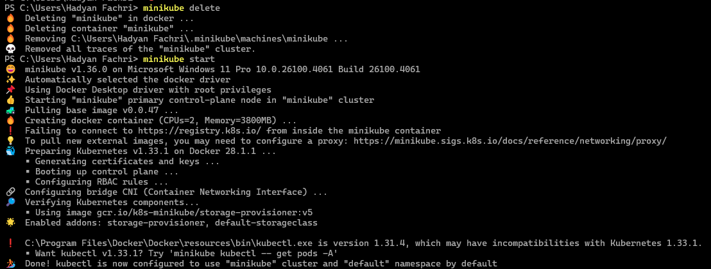
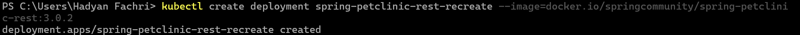
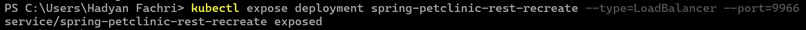
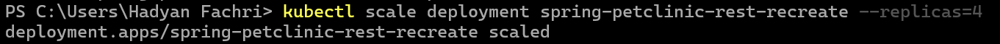

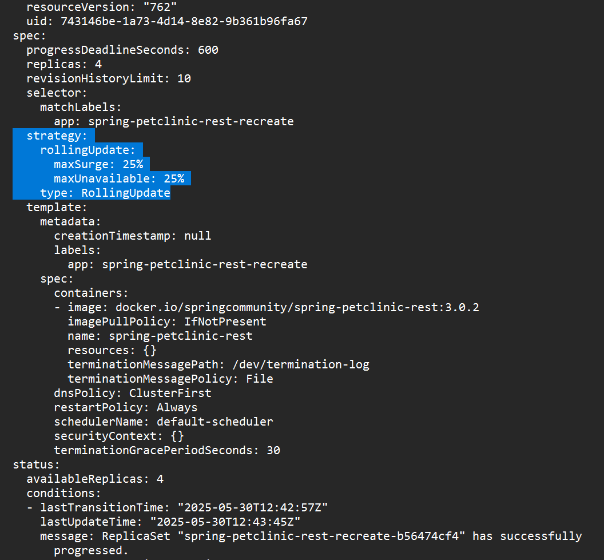
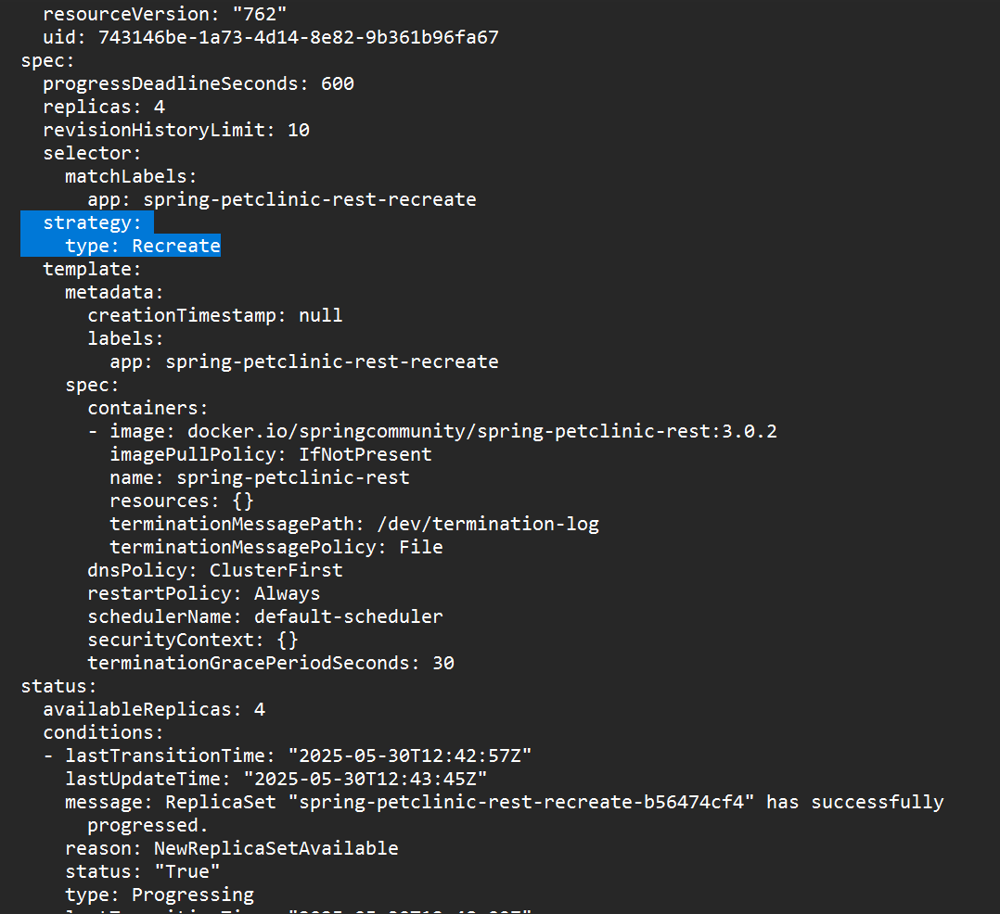
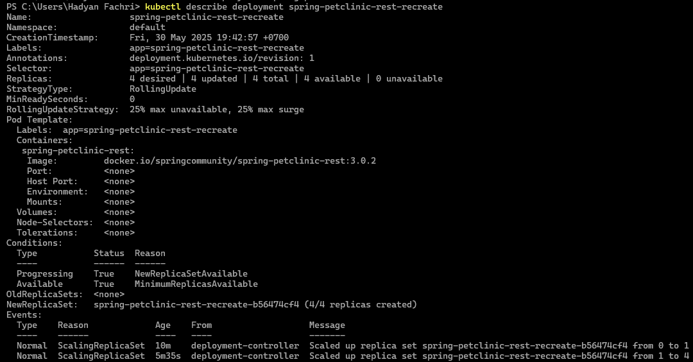
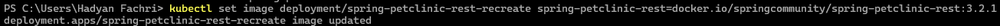
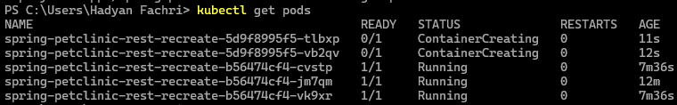
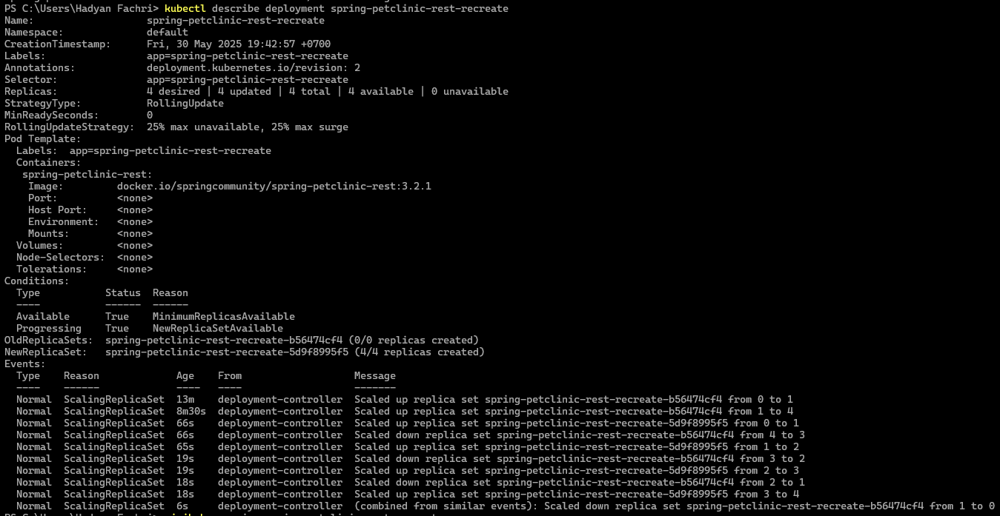
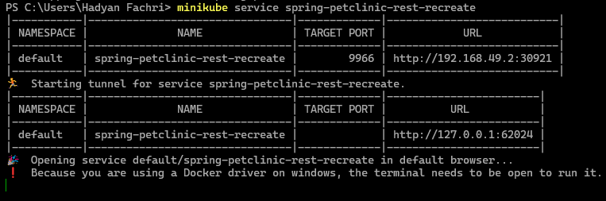
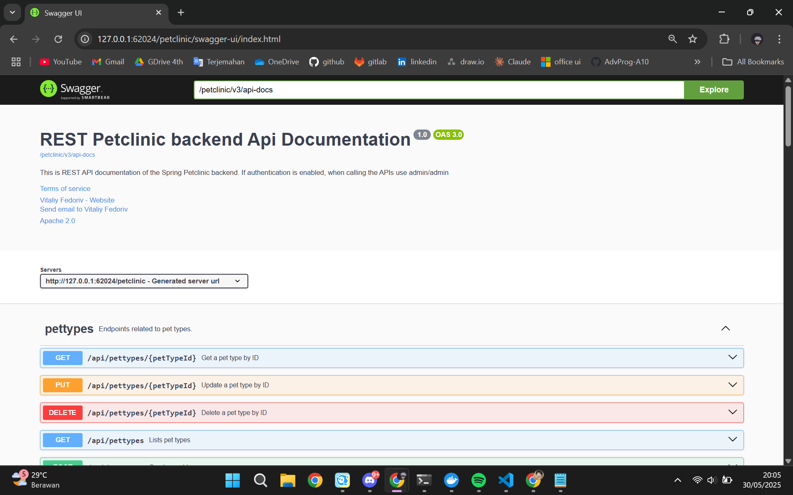

**3. Prepare different manifest files for executing Recreate deployment strategy.**

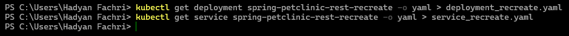

Saya telah membuat file manifest untuk strategi deployment Recreate dengan menggunakan perintah yang disediakan dalam tutorial. File manifest untuk deployment disimpan dengan nama **`deployment_recreate.yaml`**, dan file manifest untuk service disimpan dengan nama **`service_recreate.yaml`**.

**4. What do you think are the benefits of using Kubernetes manifest files? Recall your experience in deploying the app manually and compare it to your experience when deploying the same app by applying the manifest files (i.e., invoking `kubectl apply-f` command) to the cluster.**

Berdasarkan pengalaman saya saat mencoba melakukan deployment secara manual dan menggunakan manifest file, saya menemukan bahwa penggunaan manifest file memberikan banyak kemudahan. Dengan manifest file, seluruh konfigurasi yang dibutuhkan untuk deployment sudah tertulis secara eksplisit di dalam file, sehingga saya tidak perlu lagi mengatur ulang konfigurasi satu per satu setelah deployment dilakukan. Saat melakukan deployment secara manual, banyak pengaturan yang secara otomatis mengikuti nilai default, dan jika ingin menyesuaikannya, saya harus mengubahnya secara manual satu per satu. Sementara itu, jika menggunakan manifest file yang telah disiapkan dengan konfigurasi yang sesuai, saya cukup menjalankan perintah `kubectl apply -f`, dan aplikasi akan langsung ter-deploy sesuai konfigurasi yang telah ditentukan.